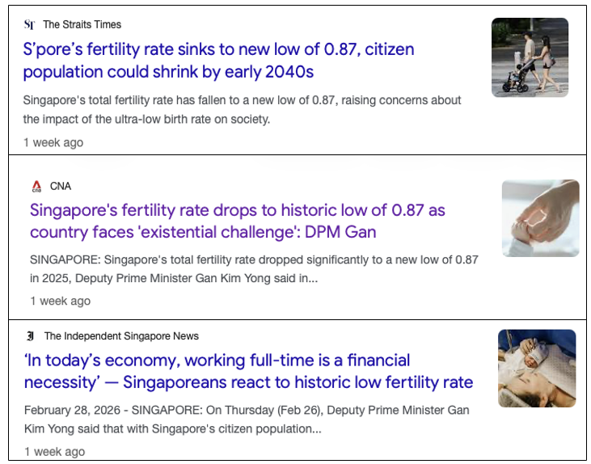
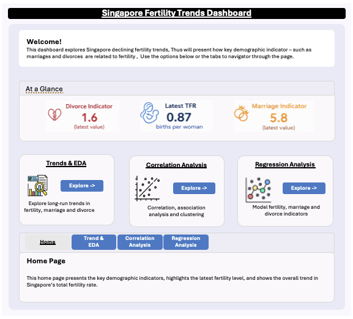
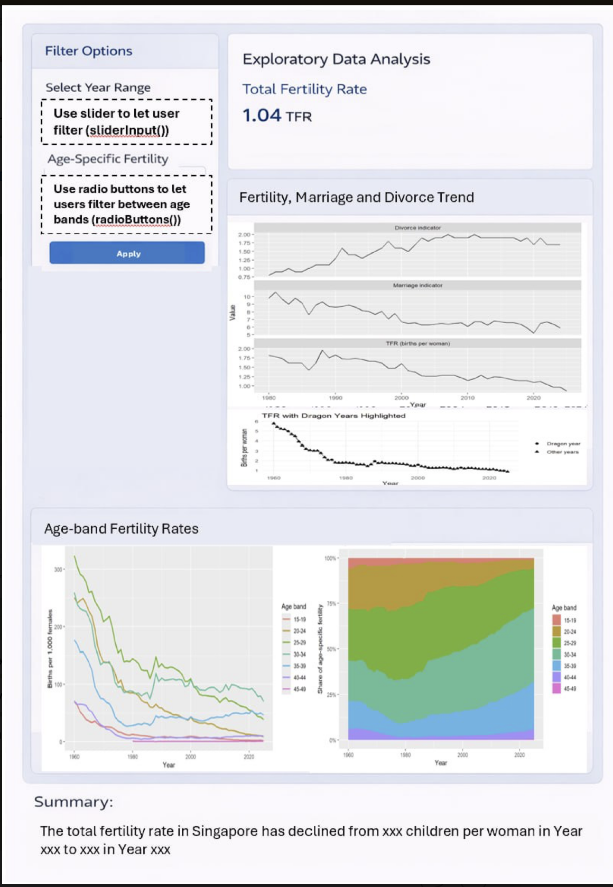
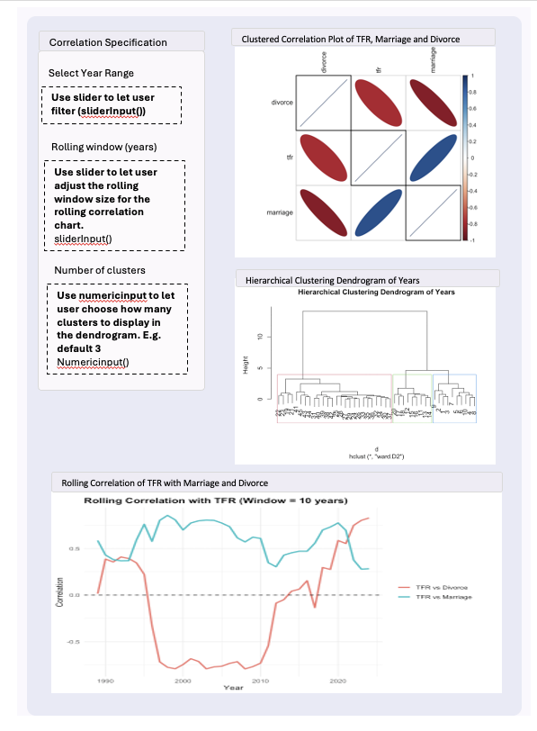
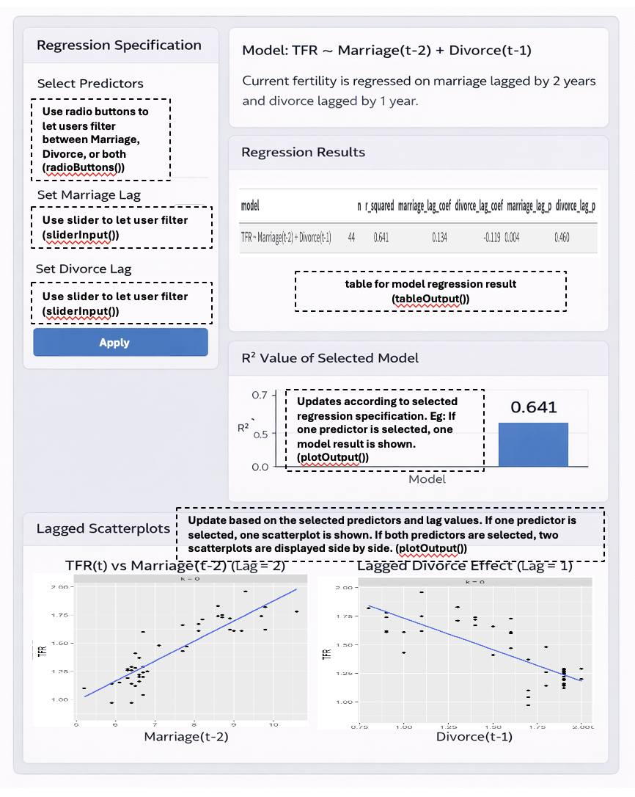

# Overview

Singapore’s total fertility rate has fallen to a historic low, raising concerns about population ageing and long-term labour force sustainability. Fertility trends may be influenced by multiple demographic factors, including marriage, divorce, and birth postponement across age groups.

```{r, out.width="90%"}

```

The goal of this project is to build an interactive dashboard that helps users explore (i) how fertility has changed over time, and (ii) whether marriage and divorce indicators are statistically associated with fertility, including possible lag effects.

This take home exercise 2 serve as the prototype for this project.

------------------------------------------------------------------------

# 1.0 Getting Started

Install and load the required R packages for data manipulation and visualisation.

```{r}
pacman::p_load(
  tidyverse, readxl, knitr, ggthemes, patchwork,
  lubridate, readr, scales, janitor
)

```

# 2.0 Loading Data

The dataset is provided in Excel format and contains multiple time series. The worksheet includes both metadata rows and actual time-series observations. The raw file consists of 815 rows and 118 columns, indicating that further cleaning is required before analysis.

```{r}
raw0 <- read_xlsx("chapthe2/data/sg fertilty population.xlsx", col_names = FALSE)
cat("Raw shape:", nrow(raw0), "rows x", ncol(raw0), "cols\n")
```

# 3.0 Data Preparation

To prepare the dataset for analysis and visualisation, the raw worksheet was cleaned in several stages. Since the Excel file contains both metadata rows and actual time-series observations, the data first had to be restructured into an analysis-ready format. The preparation process involved extracting the original series names, identifying valid date rows, removing non-data rows, converting values into numeric format, and creating cleaned datasets for the shared EDA and later analytical tasks.

As this is part of the group project, Group 16 uses the same data preparation process so that all members work from a consistent cleaned dataset before proceeding to our respective analytical tasks.

## 3.1 Extract series names (getting the variable names)

The first row of the worksheet contains the original series labels rather than actual data values/observations. This step extracts those labels, removes extra spaces, fills in any blank names with placeholders, and converts them into clean, unique variable names. A lookup table (series_key) is also created so that the cleaned names can still be traced back to the original labels in the dataset.

```{r}
series_labels <- raw0 %>%
  slice(1) %>%
  select(-1) %>%
  unlist(use.names = FALSE) %>%
  as.character() %>%
  str_squish()

blank_idx <- which(is.na(series_labels) | series_labels == "")
if (length(blank_idx) > 0) series_labels[blank_idx] <- paste0("series_", blank_idx)

series_names <- make.unique(janitor::make_clean_names(series_labels))
series_key <- tibble(series = series_names, label = series_labels)
```

Below shows a small sample of the original series labels and their cleaned variable names.

```{r,echo=FALSE}
sample_name_map <- tibble(original_label = series_labels, cleaned_name = series_names) %>%
  slice(1:10)

knitr::kable(sample_name_map)
```

## 3.2 Assign cleaned column names

After extracting the series labels, the first row is removed from the raw worksheet because it is no longer needed as data. The cleaned series names are then assigned as column names, while the first column is temporarily kept as time_raw so that it can be parsed into valid dates in the next step.

```{r}
raw1 <- raw0 %>%
  slice(-1) %>%
  setNames(c("time_raw", series_names))
```

## 3.3 Parse date rows and identify valid time-series observations (finding which rows are real dates and remove unnecessary rows)

The first column of the worksheet contains a mixture of date values and non-data text. To separate real observations from metadata rows, a custom date-parsing function is used. This function handles both standard date strings and Excel serial dates. Rows are then flagged as valid time-series rows only if the parsed date is not missing and the year falls within a reasonable range. This allows metadata and summary rows to be excluded from further analysis.

```{r}
parse_ceic_date <- function(x) {
  if (inherits(x, "Date")) return(x)
  if (inherits(x, "POSIXt")) return(as.Date(x))

  x_chr <- str_squish(as.character(x))
  dt1 <- suppressWarnings(lubridate::ymd_hms(x_chr, tz = "UTC", quiet = TRUE))
  dt2 <- suppressWarnings(lubridate::ymd(x_chr, quiet = TRUE))
  d_text <- as.Date(dplyr::coalesce(dt1, dt2))

  num <- suppressWarnings(as.numeric(x_chr))
  use_serial <- !is.na(num) & num > 10000 & num < 60000
  d_serial <- as.Date(num, origin = "1899-12-30")

  dplyr::if_else(use_serial, d_serial, d_text)
}

raw1 <- raw1 %>% mutate(date = parse_ceic_date(time_raw))

is_ts_row <- !is.na(raw1$date) &
  lubridate::year(raw1$date) >= 1900 &
  lubridate::year(raw1$date) <= 2100

stopifnot(sum(is_ts_row) > 0)
```

## 3.4 Convert values into numeric format

After identifying the valid time-series rows, the dataset is reshaped into a tidy long format where each row represents one year, one series, and one value. The raw values are then converted into numeric format so that they can be used for plotting and analysis. Where multiple observations exist for the same series within the same year, only the latest non-missing observation is kept.

At this stage, two cleaned datasets are created: df_long_clean for flexible filtering and visualisation, and df_wide_clean for easier year-based comparison across variables.

The cleaned annual panel spans from 1950 to 2025 and contains 117 usable series, showing that the raw worksheet has been successfully transformed into an analysis-ready dataset.

```{r}
df_long_clean <- raw1 %>%
  filter(is_ts_row) %>%
  mutate(year = lubridate::year(date)) %>%
  pivot_longer(
    cols = all_of(series_names),
    names_to = "series",
    values_to = "value_raw"
  ) %>%
  mutate(value = readr::parse_number(as.character(value_raw))) %>%
  filter(!is.na(value)) %>%
  group_by(series, year) %>%
  slice_max(order_by = date, n = 1, with_ties = FALSE) %>%
  ungroup() %>%
  arrange(series, year)

df_wide_clean <- df_long_clean %>%
  select(year, series, value) %>%
  pivot_wider(names_from = series, values_from = value) %>%
  arrange(year)

cat("Annual panel year range:", min(df_wide_clean$year), "to", max(df_wide_clean$year), "\n")
cat("Non-missing series:", n_distinct(df_long_clean$series), "\n")
```

## 3.5 Create final dataset for EDA and Analytical tasks

This step prepares the final working datasets used in the rest of the report. This is necessary because the cleaned dataset still contains many series, while the report only uses selected subsets for specific charts and analyses.

After identifying the key fertility, marriage, and divorce series, they are combined into a core dataset, analysis_df, for the main analysis. This dataset keeps four columns: year, tfr, marriage, and divorce. Additional datasets are also created for the EDA charts, correlation analysis and regression analysis.

```{r}
pick_series <- function(key_tbl, primary_pattern, fallback_pattern = NULL) {
  out <- key_tbl %>%
    filter(str_detect(str_to_lower(label), primary_pattern)) %>%
    slice(1) %>%
    pull(series)
  if (length(out) == 0 && !is.null(fallback_pattern)) {
    out <- key_tbl %>%
      filter(str_detect(str_to_lower(label), fallback_pattern)) %>%
      slice(1) %>%
      pull(series)
  }
  out
}

tfr_series <- pick_series(series_key, "^fertility rate: per female$")
mar_series <- pick_series(series_key, "crude marriage rate", "marriage")
div_series <- pick_series(series_key, "crude divorce rate", "divorce")

stopifnot(length(tfr_series) == 1, tfr_series %in% df_long_clean$series)
stopifnot(length(mar_series) == 1, mar_series %in% df_long_clean$series)
stopifnot(length(div_series) == 1, div_series %in% df_long_clean$series)

analysis_df <- df_long_clean %>%
  filter(series %in% c(tfr_series, mar_series, div_series)) %>%
  select(year, series, value) %>%
  pivot_wider(names_from = series, values_from = value) %>%
  arrange(year) %>%
  select(year, all_of(c(tfr_series, mar_series, div_series))) %>%
  rename(
    tfr = all_of(tfr_series),
    marriage = all_of(mar_series),
    divorce = all_of(div_series)
  )

tfr_df <- df_long_clean %>%
  filter(series == tfr_series) %>%
  arrange(year)

eda3_df <- df_long_clean %>%
  filter(series %in% c(tfr_series, mar_series, div_series)) %>%
  left_join(series_key, by = "series") %>%
  mutate(panel = case_when(
    series == tfr_series ~ "TFR (births per woman)",
    series == mar_series ~ "Marriage indicator",
    series == div_series ~ "Divorce indicator",
    TRUE ~ label
  ))

asfr_keys <- series_key %>%
  filter(str_detect(label, "^Fertility Rate: Per 1000 Female: Age")) %>%
  mutate(
    age_band = str_extract(label, "\\b\\d{2}\\s*-\\s*\\d{2}"),
    age_band = str_replace_all(age_band, "\\s*", "")
  ) %>%
  arrange(age_band)

asfr_df <- df_long_clean %>%
  semi_join(asfr_keys, by = "series") %>%
  left_join(asfr_keys, by = "series") %>%
  mutate(age_band = factor(age_band, levels = c("15-19","20-24","25-29","30-34","35-39","40-44","45-49")))

corr_df <- analysis_df %>%
  select(tfr, marriage, divorce) %>%
  cor(use = "complete.obs") %>%
  as.data.frame() %>%
  rownames_to_column("var1") %>%
  pivot_longer(-var1, names_to = "var2", values_to = "corr")

lag_cor <- function(x, y, max_lag = 10) {
  tibble(lag = 0:max_lag) %>%
    mutate(cor = map_dbl(lag, \(k) cor(x, dplyr::lag(y, k), use = "complete.obs")))
}

lag_results <- bind_rows(
  lag_cor(analysis_df$tfr, analysis_df$marriage, 10) %>% mutate(series = "Marriage leads TFR"),
  lag_cor(analysis_df$tfr, analysis_df$divorce, 10)  %>% mutate(series = "Divorce leads TFR")
)

lag_m <- 2
lag_d <- 1

analysis_lag <- analysis_df %>%
  mutate(
    marriage_lag = lag(marriage, lag_m),
    divorce_lag  = lag(divorce,  lag_d)
  ) %>%
  drop_na(marriage_lag, divorce_lag, tfr)
```

------------------------------------------------------------------------

# 4.0 EDA

Exploratory data analysis will be performed on the dataset to understand the main demographic trends and identify meaningful patterns before modelling.

The EDA will focus on three questions: when fertility began to decline, whether fertility, marriage, and divorce appear to move together over time, and whether fertility has shifted toward older age groups.

This section is shared between group members of Group 16 because it establishes the context for the later analysis.

------------------------------------------------------------------------

:::: callout-note
### 4.1 EDA 1 - Trend of total fertility rate (TFR) over time

::: panel-tabset
### Visual

```{r, echo=FALSE}
ggplot(tfr_df, aes(x = year, y = value)) +
  geom_line() +
  geom_point(size = 1) +
  labs(
    title = "Singapore Total Fertility Rate (TFR) Over Time",
    x = "Year",
    y = "Births per woman"
  )
```

### Code

``` r
ggplot(tfr_df, aes(x = year, y = value)) +
  geom_line() +
  geom_point(size = 1) +
  labs(
    title = "Singapore Total Fertility Rate (TFR) Over Time",
    x = "Year",
    y = "Births per woman"
  )
```
:::

**Observation:**\
Singapore’s total fertility rate shows a strong long-run decline from the 1960s to 2025. The steepest fall occurred between the 1960s and late 1970s, after which the rate continued to decrease more gradually with minor fluctuations. Since the mid-1970s, the TFR has remained below the replacement level of 2.1. In 2025, it reached 0.87, the lowest value in the series. A TFR of 0.87 means that, on average, a woman would be expected to have 0.87 children over her lifetime.
::::

------------------------------------------------------------------------

:::: callout-note
### 4.2 EDA 2 - Local Fertility Peaks and Dragon-Year Comparison

::: panel-tabset
### Visual

```{r, echo=FALSE}
tfr_peaks <- tfr_df %>%
  select(year, value) %>%
  rename(tfr = value) %>%
  arrange(year) %>%
  mutate(
    local_bump = tfr - (lag(tfr) + lead(tfr)) / 2,
    is_peak = tfr > lag(tfr) & tfr > lead(tfr)
  ) %>%
  drop_na()

peak_years <- tfr_peaks %>%
  filter(is_peak) %>%
  arrange(desc(local_bump))

p1 <- ggplot(tfr_peaks, aes(x = year, y = tfr)) +
  geom_line(linewidth = 1) +
  geom_point(data = peak_years, size = 2) +
  labs(
    title = "Total Fertility Rate Over Time with Local Peaks Highlighted",
    x = "Year",
    y = "Births per woman"
  ) +
  theme_minimal() +
  theme(plot.title = element_text(face = "bold"))

p2 <- ggplot(peak_years, aes(x = reorder(factor(year), local_bump), y = local_bump)) +
  geom_col() +
  coord_flip() +
  labs(
    title = "Local Bump in Peak Years",
    x = "Peak year",
    y = "Local bump"
  ) +
  theme_minimal() +
  theme(plot.title = element_text(face = "bold"))

dragon_years <- c(1964, 1976, 1988, 2000, 2012, 2024)

peak_years_check <- peak_years %>%
  mutate(dragon_flag = if_else(year %in% dragon_years, "Dragon year", "Other year"))

p3 <- ggplot(peak_years_check, aes(x = reorder(factor(year), local_bump), y = local_bump, fill = dragon_flag)) +
  geom_col() +
  coord_flip() +
  labs(
    title = "Peak Years and Dragon-Year Overlap",
    x = "Peak year",
    y = "Local bump",
    fill = NULL
  ) +
  theme_minimal() +
  theme(plot.title = element_text(face = "bold"))

p1 / p2
p3

```

### Code

``` r
tfr_peaks <- tfr_df %>%
  select(year, value) %>%
  rename(tfr = value) %>%
  arrange(year) %>%
  mutate(
    local_bump = tfr - (lag(tfr) + lead(tfr)) / 2,
    is_peak = tfr > lag(tfr) & tfr > lead(tfr)
  ) %>%
  drop_na()

peak_years <- tfr_peaks %>%
  filter(is_peak) %>%
  arrange(desc(local_bump))

p1 <- ggplot(tfr_peaks, aes(x = year, y = tfr)) +
  geom_line(linewidth = 1) +
  geom_point(data = peak_years, size = 2) +
  labs(
    title = "Total Fertility Rate Over Time with Local Peaks Highlighted",
    x = "Year",
    y = "Births per woman"
  ) +
  theme_minimal() +
  theme(plot.title = element_text(face = "bold"))

p2 <- ggplot(peak_years, aes(x = reorder(factor(year), local_bump), y = local_bump)) +
  geom_col() +
  coord_flip() +
  labs(
    title = "Local Bump in Peak Years",
    x = "Peak year",
    y = "Local bump"
  ) +
  theme_minimal() +
  theme(plot.title = element_text(face = "bold"))

dragon_years <- c(1964, 1976, 1988, 2000, 2012, 2024)

peak_years_check <- peak_years %>%
  mutate(dragon_flag = if_else(year %in% dragon_years, "Dragon year", "Other year"))

p3 <- ggplot(peak_years_check, aes(x = reorder(factor(year), local_bump), y = local_bump, fill = dragon_flag)) +
  geom_col() +
  coord_flip() +
  labs(
    title = "Peak Years and Dragon-Year Overlap",
    x = "Peak year",
    y = "Local bump",
    fill = NULL
  ) +
  theme_minimal() +
  theme(plot.title = element_text(face = "bold"))

p1 / p2
p3
```
:::

**Observation:**\
Although TFR shows a clear long-run decline, several short-term local peaks are still visible in the series. To examine these increases, local peak years were identified and compared with dragon years, which are commonly associated with higher birth numbers. The local bump measures how much a year’s TFR exceeds the average of the year before and after it. For example, a local bump of 0.10 means the TFR is 0.10 births per woman above its immediate surrounding trend. The results show that some prominent peaks, such as 1976, 1988 and 2000, coincide with dragon years, while others do not. This suggests that dragon years may contribute to selected fertility spikes, but they do not explain all local fluctuations.
::::

------------------------------------------------------------------------

:::: callout-note
### 4.3 EDA 3: Fertility, Marriage and Divorce Trends (context against TFR)

::: panel-tabset
### Visual

```{r, echo=FALSE}
# common theme
common_theme <- theme_minimal() +
  theme(
    plot.title = element_text(face = "bold")
  )

# total fertility rate
tfr_plot <- eda3_df %>%
  filter(grepl("TFR", panel, ignore.case = TRUE)) %>%
  ggplot(aes(x = year, y = value)) +
  geom_line(linewidth = 1) +
  labs(
    title = "Total Fertility Rate Over Time",
    x = "Year",
    y = "TFR"
  ) +
  common_theme

# marriage trend
marriage_plot <- eda3_df %>%
  filter(grepl("Marriage", panel, ignore.case = TRUE)) %>%
  ggplot(aes(x = year, y = value)) +
  geom_line(linewidth = 1) +
  labs(
    title = "Marriage Trends Over Time",
    x = "Year",
    y = "Marriage Rate"
  ) +
  common_theme

# divorce trend
divorce_plot <- eda3_df %>%
  filter(grepl("Divorce", panel, ignore.case = TRUE)) %>%
  ggplot(aes(x = year, y = value)) +
  geom_line(linewidth = 1) +
  labs(
    title = "Divorce Trends Over Time",
    x = "Year",
    y = "Divorce Rate"
  ) +
  common_theme

# combine plots
tfr_plot / marriage_plot / divorce_plot
```

### Code

``` r
# common theme
common_theme <- theme_minimal() +
  theme(
    plot.title = element_text(face = "bold")
  )

# total fertility rate
tfr_plot <- eda3_df %>%
  filter(grepl("TFR", panel, ignore.case = TRUE)) %>%
  ggplot(aes(x = year, y = value)) +
  geom_line(linewidth = 1) +
  labs(
    title = "Total Fertility Rate Over Time",
    x = "Year",
    y = "TFR"
  ) +
  common_theme

# marriage trend
marriage_plot <- eda3_df %>%
  filter(grepl("Marriage", panel, ignore.case = TRUE)) %>%
  ggplot(aes(x = year, y = value)) +
  geom_line(linewidth = 1) +
  labs(
    title = "Marriage Trends Over Time",
    x = "Year",
    y = "Marriage Rate"
  ) +
  common_theme

# divorce trend
divorce_plot <- eda3_df %>%
  filter(grepl("Divorce", panel, ignore.case = TRUE)) %>%
  ggplot(aes(x = year, y = value)) +
  geom_line(linewidth = 1) +
  labs(
    title = "Divorce Trends Over Time",
    x = "Year",
    y = "Divorce Rate"
  ) +
  common_theme

# combine plots
tfr_plot / marriage_plot / divorce_plot
```
:::

**Observation:**\
TFR shows a clear long-run decline, while the available marriage and divorce series from around 1980 onward show a general decline in marriage rates and a rise in divorce rates before stabilising in recent years. Taken together, these patterns suggest that lower fertility in Singapore has occurred alongside lower marriage rates and higher divorce rates over time. However, these descriptive trends do not by themselves establish causality.

::::

------------------------------------------------------------------------

:::: callout-note
### 4.4 EDA 4: Scatterplots of TFR Against Marriage and Divorce

::: panel-tabset
### Visual

```{r, echo=FALSE}
p_mar <- ggplot(analysis_df, aes(x = marriage, y = tfr)) +
  geom_point(size = 2, alpha = 0.7) +
  geom_smooth(method = "lm", se = FALSE, linewidth = 1) +
  coord_cartesian(ylim = c(0.8, 2.1)) +
  labs(
    title = "TFR vs Marriage",
    x = "Marriage rate",
    y = "Births per woman"
  ) +
  theme_minimal() +
  theme(
    plot.title = element_text(face = "bold")
  )

p_div <- ggplot(analysis_df, aes(x = divorce, y = tfr)) +
  geom_point(size = 2, alpha = 0.7) +
  geom_smooth(method = "lm", se = FALSE, linewidth = 1) +
  coord_cartesian(ylim = c(0.8, 2.1)) +
  labs(
    title = "TFR vs Divorce",
    x = "Divorce rate",
    y = "Births per woman"
  ) +
  theme_minimal() +
  theme(
    plot.title = element_text(face = "bold")
  )

p_mar / p_div
```

### Code

``` r
p_mar <- ggplot(analysis_df, aes(x = marriage, y = tfr)) +
  geom_point(size = 2, alpha = 0.7) +
  geom_smooth(method = "lm", se = FALSE, linewidth = 1) +
  coord_cartesian(ylim = c(0.8, 2.1)) +
  labs(
    title = "TFR vs Marriage",
    x = "Marriage rate",
    y = "Births per woman"
  ) +
  theme_minimal() +
  theme(
    plot.title = element_text(face = "bold")
  )

p_div <- ggplot(analysis_df, aes(x = divorce, y = tfr)) +
  geom_point(size = 2, alpha = 0.7) +
  geom_smooth(method = "lm", se = FALSE, linewidth = 1) +
  coord_cartesian(ylim = c(0.8, 2.1)) +
  labs(
    title = "TFR vs Divorce",
    x = "Divorce rate",
    y = "Births per woman"
  ) +
  theme_minimal() +
  theme(
    plot.title = element_text(face = "bold")
  )

p_mar / p_div
```
:::

**Observation:**\
The scatterplots suggest a positive association between TFR and marriage, and a negative association between TFR and divorce. In general, years with higher marriage values tend to be associated with higher fertility, while years with higher divorce values tend to be associated with lower fertility. However, these patterns are descriptive and may partly reflect shared long-run time trends rather than a direct causal relationship.

::::

------------------------------------------------------------------------

------------------------------------------------------------------------

:::: callout-note
### 4.5 EDA 5: Correlation Matrix of TFR, Marriage and Divorce

::: panel-tabset
### Visual

```{r, echo=FALSE}
corr_mat <- analysis_df %>%
  select(tfr, marriage, divorce) %>%
  cor(use = "complete.obs")

corr_df <- as.data.frame(as.table(corr_mat))

ggplot(corr_df, aes(x = Var1, y = Var2, fill = Freq)) +
  geom_tile(color = "white") +
  geom_text(aes(label = round(Freq, 2))) +
  labs(
    title = "Correlation Matrix ",
    x = NULL,
    y = NULL,
    fill = "Correlation"
  ) +
  theme_minimal() +
  theme(
    plot.title = element_text(face = "bold"),
    axis.text.x = element_text(angle = 45, hjust = 1)
  )

```

### Code

``` r
corr_mat <- analysis_df %>%
  select(tfr, marriage, divorce) %>%
  cor(use = "complete.obs")

corr_df <- as.data.frame(as.table(corr_mat))

ggplot(corr_df, aes(x = Var1, y = Var2, fill = Freq)) +
  geom_tile(color = "white") +
  geom_text(aes(label = round(Freq, 2))) +
  labs(
    title = "Correlation Matrix",
    x = NULL,
    y = NULL,
    fill = "Correlation"
  ) +
  theme_minimal() +
  theme(
    plot.title = element_text(face = "bold"),
    axis.text.x = element_text(angle = 45, hjust = 1)
  )
```
:::

**Observation:**\
The correlation matrix shows that TFR is strongly positively correlated with marriage and strongly negatively correlated with divorce. Marriage and divorce are also strongly negatively correlated with each other. Overall, this indicates that higher fertility tends to be associated with higher marriage values and lower divorce values in the data, although these correlations may partly reflect shared long-run trends.
::::

------------------------------------------------------------------------

# 5.0 Analytical Tasks

This section presents the analytical component of the project. As the broader dashboard is developed as a group project, the analytical tasks are split across members.

My groupmate, Sze Ching, focuses on regression-based analysis, while my focus in this report is on correlation-based analysis and related association checks. In particular, I examine how total fertility rate (TFR) is associated with marriage and divorce indicators, and whether these relationships remain stable when trends, timing differences, and time variation are taken into account.

The correlation component is designed to support the planned Shiny application, where users will be able to interactively explore the strength, direction, and stability of these relationships. This helps complement the descriptive visualisations by providing a more structured analytical layer for understanding how fertility patterns move alongside marriage and divorce indicators over time.

While time-series forecasting is one possible analytical direction under this project theme, this project focuses on exploratory and explanatory analysis of fertility trends rather than predictive modelling. Specifically, the project examines how Singapore’s Total Fertility Rate has evolved over time and how it relates to demographic indicators such as marriage and divorce. The analytical components therefore emphasise time-series visualisation, correlation analysis, rolling correlations, and regression with lagged variables. These techniques support interactive exploration within the Shiny application and help users better understand the relationships and temporal dynamics present in the demographic time-series data.

:::: callout-note
### 5.1 Analysis 1: Correlation in Levels and First Differences

::: panel-tabset
### Visual

```{r, echo=FALSE}
# correlation matrix in levels
cor_levels <- analysis_df %>%
  select(tfr, marriage, divorce) %>%
  cor(use = "complete.obs")

# clustered correlation plot
corrplot::corrplot(
  cor_levels,
  method = "ellipse",
  tl.col = "black",
  order = "hclust",
  hclust.method = "ward.D2",
  addrect = 3
)

# create first differences
diff_df <- analysis_df %>%
  arrange(year) %>%
  mutate(
    dtfr = tfr - lag(tfr),
    dmarriage = marriage - lag(marriage),
    ddivorce = divorce - lag(divorce)
  ) %>%
  drop_na()

# correlation matrix in first differences
cor_diff <- diff_df %>%
  select(dtfr, dmarriage, ddivorce) %>%
  cor(use = "complete.obs")

# comparison table
out_tbl <- data.frame(
  Pair = c("TFR vs Marriage", "TFR vs Divorce", "Marriage vs Divorce"),
  `Correlation in Levels` = c(
    cor_levels["tfr", "marriage"],
    cor_levels["tfr", "divorce"],
    cor_levels["marriage", "divorce"]
  ),
  `Correlation in First Differences` = c(
    cor_diff["dtfr", "dmarriage"],
    cor_diff["dtfr", "ddivorce"],
    cor_diff["dmarriage", "ddivorce"]
  ),
  check.names = FALSE
)

knitr::kable(
  out_tbl,
  digits = 3,
  caption = "Comparison of correlations in levels and first differences"
)
```

### Code

``` r
# correlation matrix in levels
cor_levels <- analysis_df %>%
  select(tfr, marriage, divorce) %>%
  cor(use = "complete.obs")

# clustered correlation plot
corrplot::corrplot(
  cor_levels,
  method = "ellipse",
  tl.col = "black",
  order = "hclust",
  hclust.method = "ward.D2",
  addrect = 3
)

# create first differences
diff_df <- analysis_df %>%
  arrange(year) %>%
  mutate(
    dtfr = tfr - lag(tfr),
    dmarriage = marriage - lag(marriage),
    ddivorce = divorce - lag(divorce)
  ) %>%
  drop_na()

# correlation matrix in first differences
cor_diff <- diff_df %>%
  select(dtfr, dmarriage, ddivorce) %>%
  cor(use = "complete.obs")

# comparison table
out_tbl <- data.frame(
  Pair = c("TFR vs Marriage", "TFR vs Divorce", "Marriage vs Divorce"),
  `Correlation in Levels` = c(
    cor_levels["tfr", "marriage"],
    cor_levels["tfr", "divorce"],
    cor_levels["marriage", "divorce"]
  ),
  `Correlation in First Differences` = c(
    cor_diff["dtfr", "dmarriage"],
    cor_diff["dtfr", "ddivorce"],
    cor_diff["dmarriage", "ddivorce"]
  ),
  check.names = FALSE
)

knitr::kable(
  out_tbl,
  digits = 3,
  caption = "Comparison of correlations in levels and first differences"
)
```
:::

**Observation:**\
The correlations in levels show that TFR is positively associated with marriage and negatively associated with divorce, while marriage and divorce are also strongly negatively related. However, the first-difference results indicate that these relationships weaken to different degrees after removing long-run trend effects. In particular, the TFR–divorce correlation falls sharply after differencing, suggesting that its strong negative relationship in levels is largely trend-driven. By contrast, the TFR–marriage correlation remains moderately positive after differencing, indicating that some association is still present in year-to-year changes.
::::

------------------------------------------------------------------------

:::: callout-note
### 5.2 Analysis 2: Rolling Correlation with TFR

::: panel-tabset
### Visual

```{r, echo=FALSE}
win <- 10

roll_df <- analysis_df %>%
  select(year, tfr, marriage, divorce) %>%
  drop_na() %>%
  arrange(year)

n <- nrow(roll_df)
years_end <- roll_df$year[win:n]

cor_mar <- numeric(length(years_end))
cor_div <- numeric(length(years_end))

for (i in win:n) {
  idx <- (i - win + 1):i
  cor_mar[i - win + 1] <- cor(roll_df$tfr[idx], roll_df$marriage[idx], use = "complete.obs")
  cor_div[i - win + 1] <- cor(roll_df$tfr[idx], roll_df$divorce[idx], use = "complete.obs")
}

roll_out <- data.frame(
  year = years_end,
  `TFR vs Marriage` = cor_mar,
  `TFR vs Divorce` = cor_div,
  check.names = FALSE
) %>%
  pivot_longer(
    cols = c(`TFR vs Marriage`, `TFR vs Divorce`),
    names_to = "series",
    values_to = "correlation"
  )

ggplot(roll_out, aes(x = year, y = correlation, colour = series)) +
  geom_line(linewidth = 1) +
  geom_hline(yintercept = 0, linetype = 2) +
  labs(
    title = paste("Rolling Correlation with TFR (Window =", win, "years)"),
    x = "Year",
    y = "Correlation",
    colour = NULL
  ) +
  theme_minimal() +
  theme(
    plot.title = element_text(face = "bold")
  )
```

### Code

``` r
win <- 10

roll_df <- analysis_df %>%
  select(year, tfr, marriage, divorce) %>%
  drop_na() %>%
  arrange(year)

n <- nrow(roll_df)
years_end <- roll_df$year[win:n]

cor_mar <- numeric(length(years_end))
cor_div <- numeric(length(years_end))

for (i in win:n) {
  idx <- (i - win + 1):i
  cor_mar[i - win + 1] <- cor(roll_df$tfr[idx], roll_df$marriage[idx], use = "complete.obs")
  cor_div[i - win + 1] <- cor(roll_df$tfr[idx], roll_df$divorce[idx], use = "complete.obs")
}

roll_out <- data.frame(
  year = years_end,
  `TFR vs Marriage` = cor_mar,
  `TFR vs Divorce` = cor_div,
  check.names = FALSE
) %>%
  pivot_longer(
    cols = c(`TFR vs Marriage`, `TFR vs Divorce`),
    names_to = "series",
    values_to = "correlation"
  )

ggplot(roll_out, aes(x = year, y = correlation, colour = series)) +
  geom_line(linewidth = 1) +
  geom_hline(yintercept = 0, linetype = 2) +
  labs(
    title = paste("Rolling Correlation with TFR (Window =", win, "years)"),
    x = "Year",
    y = "Correlation",
    colour = NULL
  ) +
  theme_minimal() +
  theme(
    plot.title = element_text(face = "bold")
  )
```
:::

**Observation:**\
The rolling correlations show that the association between TFR and marriage remains positive across most windows, suggesting a relatively more consistent positive relationship over time. In contrast, the correlation between TFR and divorce varies substantially, becoming strongly negative in some periods and positive in others. This suggests that marriage is more consistently associated with fertility in the dataset, while the relationship with divorce is less stable over time. The analysis is based on the common overlapping period from 1980 to 2024, where all three series are available in comparable form. With a 10-year rolling window, the plotted rolling correlations begin later because each point summarises the relationship over the preceding 10 years.

::::

------------------------------------------------------------------------

:::: callout-note
### 5.3 Analysis 3: Hierarchical Clustering of Years by TFR, Marriage and Divorce

::: panel-tabset
### Visual

```{r, echo=FALSE}
# prepare data for clustering
cluster_df <- analysis_df %>%
  select(year, tfr, marriage, divorce) %>%
  drop_na() %>%
  arrange(year)

# standardise variables
cluster_mat <- cluster_df %>%
  select(tfr, marriage, divorce) %>%
  scale()

# use actual years as labels
rownames(cluster_mat) <- cluster_df$year

# hierarchical clustering
d <- dist(cluster_mat, method = "euclidean")
hc <- hclust(d, method = "ward.D2")

# dendrogram
plot(
  hc,
  main = "Hierarchical Clustering Dendrogram of Years",
  xlab = "",
  sub = "",
  cex = 0.7
)

rect.hclust(hc, k = 3, border = 2:4)

```

### Code

``` r

# prepare data for clustering
cluster_df <- analysis_df %>%
  select(year, tfr, marriage, divorce) %>%
  drop_na() %>%
  arrange(year)

# standardise variables
cluster_mat <- cluster_df %>%
  select(tfr, marriage, divorce) %>%
  scale()

# use actual years as labels
rownames(cluster_mat) <- cluster_df$year

# hierarchical clustering
d <- dist(cluster_mat, method = "euclidean")
hc <- hclust(d, method = "ward.D2")

# dendrogram
plot(
  hc,
  main = "Hierarchical Clustering Dendrogram of Years",
  xlab = NULL,
  sub = NULL,
  cex = 0.7
)

rect.hclust(hc, k = 3, border = 2:4)
```
:::

**Observation:**\
Hierarchical clustering groups years according to similar combinations of TFR, marriage and divorce. Using a three-cluster cut, the dendrogram suggests that the years can be grouped into three broad phases with similar demographic profiles. This indicates that Singapore’s fertility, marriage and divorce patterns did not change uniformly over time, but instead appear to have evolved across a few distinct periods.
::::

------------------------------------------------------------------------

# 6.0 UI Design

Below is the proposed UI design for the Shiny application. Since this dashboard is developed as a group project, the general UI structure will be shared across group members. However, the analytical modules displayed within the application may differ according to each member’s assigned task.

The prototype will first be developed and tested in Quarto using R code and static outputs. It will then be adapted into a Shiny dashboard with interactive controls such as filters.

### 6.1 Figure 1: Proposed summary layout / Home Page

The Home Page is designed to provide users with a high-level overview of Singapore’s fertility trends and the main purpose of the dashboard. It will include a short introduction to the issue of declining fertility, headline indicators such as the latest total fertility rate, and a brief explanation of the three main areas of analysis: trend exploration, Correlation analysis, and relationship analysis with marriage and divorce indicators.

The purpose of this page is to orient users before they move into the detailed analytical sections. It allows users to quickly understand what the dashboard is about and what questions it can help answer.

This will be completed by me.



### 6.2 Figure 2: Proposed layout of the EDA page

The EDA page will allow users to interactively explore the main demographic trends in the dataset. This page will include line charts for total fertility rate, marriage, divorce, and age-specific fertility rates. Users will be able to filter the year range and select which age group they wish to display.

The purpose of this page is to help users identify broad patterns before moving into more formal analysis. For example, users can observe when fertility started declining, whether marriage and divorce indicators move in similar or opposite directions, and whether fertility has shifted towards older age groups over time.

Possible Shiny UI components for this page include: (1) sliderInput() for year range, (2) radioButtons() for selecting age bands, (3) using plotOutput() for interactive charts

This will be completed by group member Sze Ching.



### 6.3 Figure 3: Proposed layout of the Analytical Tasks

The Analytical Tasks page will support deeper investigation into the relationship between fertility and related demographic indicators. This section will contain separate modules for correlation analysis and regression analysis.

#### 6.3.1 Correlation Analysis

The Correlation Analysis page is designed to let users interactively examine how fertility is associated with marriage and divorce indicators across different time periods and analytical settings.

The layout will consist of a control panel on the left and an output panel on the right. In the control panel, users will be able to filter the year range to focus on a selected analysis period.

The output panel will display three main elements. First, a clustered correlation plot will summarise the overall correlation structure between total fertility rate, marriage, and divorce indicators. Second, a hierarchical clustering dendrogram will group years according to similar combinations of fertility, marriage, and divorce patterns so that users can identify broad phases in the demographic series. Third, a rolling correlation chart will show how the correlation between fertility and each indicator changes across time windows, allowing users to assess whether the observed relationships are stable or time-varying.

Possible Shiny UI components for this page include: (1) sliderInput() for year range, (2) plotOutput() for the clustered correlation plot, (3) plotOutput() for the hierarchical clustering dendrogram, and (4) plotOutput() for the rolling correlation chart.

This will be completed by me.



#### 6.3.2 Regression Analysis

The Regression Analysis page is designed to let users interactively examine whether fertility is associated with marriage and divorce indicators under different lag assumptions.

The layout will consist of a control panel on the left and an output panel on the right. In the control panel, users will be able to choose whether the regression should use marriage only, divorce only, or both predictors together. Users will also be able to specify the delayed effect by adjusting separate lag values for marriage and divorce. A lag value of 0 will correspond to the baseline same-year model, while higher lag values will represent delayed-effect models.

The output panel will display three main elements. First, a regression results table will summarise the fitted model, including the sample size, R2, coefficients, and p-values. Second, a column chart will show the R2 value of the selected regression specification so that users can quickly compare how well different lag choices fit the data. Third, scatterplots with fitted regression lines will provide a visual view of the relationship between current fertility and the selected lagged predictor values. These plots help users see whether the direction and apparent strength of the relationship change as the lag settings are adjusted.

Possible Shiny UI components for this page include: (1) radioButtons() for choosing regression specification: marriage only, divorce only, or both, (2) sliderInput() for marriage lag, (3) sliderInput() for divorce lag, (4) tableOutput() for regression results, (5) plotOutput() for the R2 column chart, (6) plotOutput() for the lagged scatterplots

This will be completed by group member Sze Ching.



### 6.4 Conclusion

Overall, this prototype outlines the initial design of a Shiny dashboard for exploring Singapore’s fertility trends. The dashboard is intended to help users understand how fertility has changed over time and how fertility is associated with marriage and divorce indicators.

The design combines exploratory visualisation and analytical modelling within a single interactive application. By including filters, the dashboard allows users to tailor the analysis to their own interests.

### 7.0 Package Selection Justification

To support the development of the Shiny application, we selected packages based on clarity of output, ease of integration with Shiny, interpretability and suitability for the project scope.

For visualisation, we selected **ggplot2** as the main charting library because it produces clear and consistent visual output, is easy to customise, and integrates well with Shiny through **plotOutput()**. It is well suited for presenting demographic time-series trends, scatterplots and rolling correlation charts in a structured and readable format.

For correlation analysis, we used the **cor()** function to compute correlation matrices and the **corrplot** package to visualise them. This library was selected because it provides clear graphical representations of correlation structures, including clustered correlation matrices that help highlight relationships among fertility, marriage, and divorce indicators.

For arranging multiple charts in the same output view, we used **patchwork** because it allows plots to be combined in a simple and flexible way while keeping the code readable.

For statistical modelling, we used **lm()** for regression because they are sufficient for the scope of this project. Since the Shiny app is intended to support interactive exploration, simpler and more explainable models were preferred.

